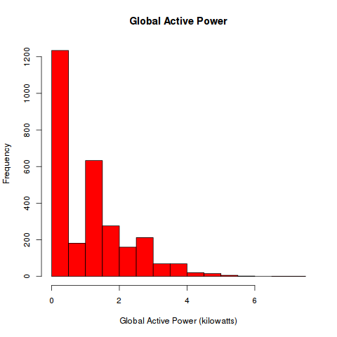

# Exploratory_week1
Solutions to the first weeks project in exploratory data analysis

## Task

Though not stated clearly the task seems to create 4 different plots using R and a given data set

## Prerequisites

- Data: [Dataset](https://d396qusza40orc.cloudfront.net/exdata%2Fdata%2Fhousehold_power_consumption.zip)
- R-Libraries `ggplot2` and `jpeg`

## Learned things

- using the `with` command in R makes things much easier in plotting data frames
- converting dates and times with `strptime()` needs a complete date time string, otherwise today is used as date
- Downloading files is easy with `download.file()`

## Results

### Task 1:

A Histogram, only thing different than standard in `hist` is the option `col="red"`

### Task 2:

A simple black and white line plot, using the `plot` with the option `type="l"`

### Task 3:

Creating a plot with 3 lines is a bit different than creating a one line plot. First create an empty plot, than add lines. **Attention:** Labels must be specified manually otherwise every data set will add its own labels

### Task 4:

